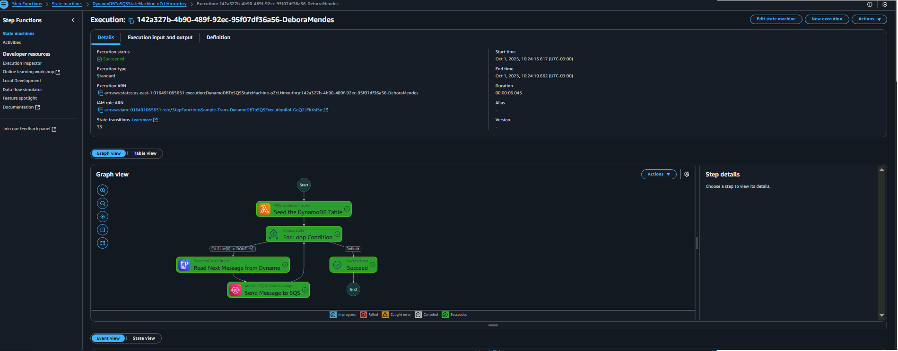
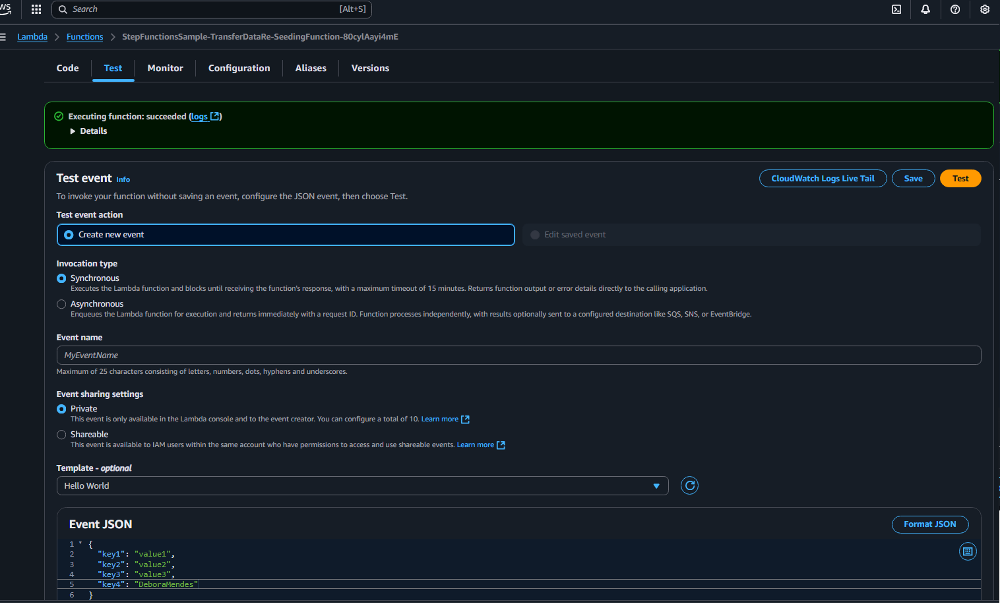
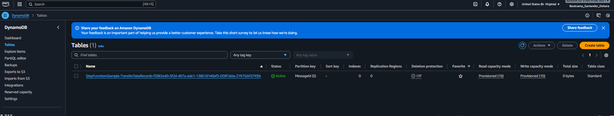
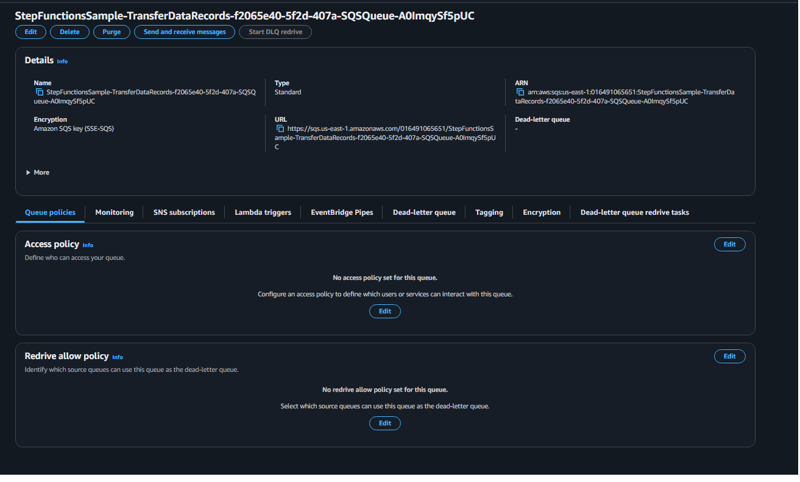

# Projeto AWS Step Function

## Step Function
AWS Step Functions é um serviço que permite coordenar múltiplos serviços da AWS em um workflow serverless. É como um organizador visual para os componentes da sua aplicação. Em vez de escrever código para gerenciar lógicas complexas, é definido uma máquina de estados que orquestra o fluxo da sua aplicação. Pode-se arrastar e soltar etapas, como uma função Lambda, uma tarefa no ECS ou um trabalho no Glue, e o Step Functions vai gerenciar todo o processo, incluindo monitorar o progresso, tratar falhas e fornecer logs detalhados para cada etapa.
Se os serviços que serão utilizados no projeto escolhido não estiverem ativos esse serviço os criam e inicializam eles de forma automatica.

## Projeto
Escolhi este projeto que mostra a construção de um workflow utilizando o Step Function na AWS que usa a função Lambda para preencher a tabela DynamoDB. A máquina de estado também usa um loop for para ler cada uma das entradas e, em seguida, envia cada entrada para uma fila Amazon SQS.
Neste caso o Lambda, DynamoDB e o amazon SQS não estavam criados e foram iniciados automaticamente pelo step function. 

### Lambda
O AWS Lambda é um serviço de computação serverless que permite rodar código sem precisar se preocupar com servidores. Faz o upload do seu código (como uma função em Python, Node.js ou Java), e a AWS cuida de todo o resto: o provisionamento dos servidores, a execução do código e o escalonamento.

O Lambda é a execução "orientada a eventos" (event-driven), o código só é executado em resposta a um trigger (gatilho).

### DynamoBD 
O Amazon DynamoDB é um serviço de banco de dados NoSQL totalmente gerenciado pela AWS. Ele foi projetado para aplicações que precisam de performance em escala, oferecendo latência de milissegundos para qualquer volume de tráfego.

Ele é um banco de dados que não usa tabelas rígidas como o Excel. Em vez disso, ele armazena dados em itens, onde cada item é composto por pares de chave:valor, tornando-o extremamente flexível e rápido.

### Amazon SQS
O Amazon SQS (Simple Queue Service) é um serviço de filas de mensagens totalmente gerenciado que permite desacoplar e dimensionar microsserviços, sistemas distribuídos e aplicativos serverless. Ele trabalha com 2 tipo de fila
* Filas Standard: O tipo padrão, com alto volume de mensagens e entrega "pelo menos uma vez". A ordem das mensagens não é garantida.

* Filas FIFO (First-In, First-Out): Garantem que as mensagens sejam processadas na ordem exata em que foram enviadas e entregues "exatamente uma vez". Isso é ideal para casos onde a ordem é crítica.
usado principalmente para fornecer dados entre aplicativos.

 

